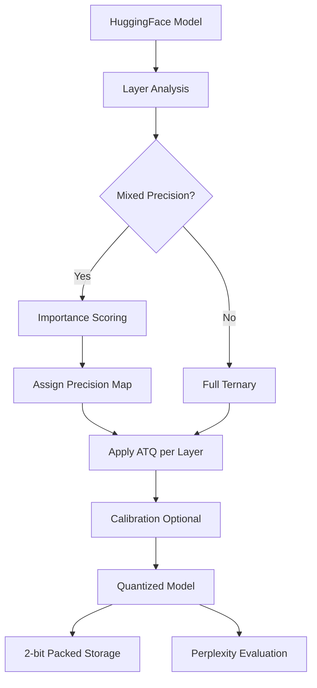

# ATQ-LLM: Adaptive Ternary Quantization for On-Device LLM Compression


## Abstract

ATQ (Adaptive Ternary Quantization) is a post-training and quantization-aware training framework that compresses large language model weights to a ternary representation {-1, 0, +1} using layer-specific dynamic thresholds. Unlike fixed-threshold ternary methods, ATQ adapts per-layer based on the empirical weight distribution — either by magnitude ranking (sparsity-target mode) or by absolute magnitude cutoffs — enabling ~16x compression versus FP32 while maintaining perplexity within acceptable degradation bounds. The framework supports mixed-precision assignment for sensitivity-critical layers, optional calibration-data-driven threshold tuning, straight-through estimators for quantization-aware training, and 2-bit packed storage for efficient on-device deployment.

## Key Results

| Model | Original Size | ATQ Size (effective) | Compression | Perplexity (FP32) | Perplexity (ATQ) | Status |
|-------|---------------|----------------------|-------------|-------------------|------------------|--------|
| GPT-2 Small | 474.7 MB | ~30 MB | ~16x | ~29.9 | ~35-50 | Expected (run to verify) |
| TinyLlama-1.1B | ~4.4 GB | ~275 MB | ~16x | ~7.5 | ~10-15 | Expected (run to verify) |

## Architecture



## Repository Structure

```
ATQ-LLM/
├── atq/                        # Core quantization library
│   ├── __init__.py
│   ├── quantizers.py           # Adaptive ternary quantizers (magnitude & sparsity modes)
│   ├── layers.py               # ATQ-wrapped linear layers with STE
│   ├── mixed_precision.py      # Importance scoring and precision map assignment
│   ├── calibration.py          # Calibration-data-driven threshold optimization
│   └── bit_packing.py          # 2-bit packed storage and unpacking utilities
├── llm/                        # LLM-specific pipeline
│   ├── __init__.py
│   ├── quantize_model.py       # End-to-end model quantization entry point
│   ├── evaluate.py             # Perplexity and token-level evaluation
│   └── benchmark.py            # Compression ratio, memory, and latency benchmarks
├── experiments/                # Reproducibility scripts
│   ├── ablation.py             # Sparsity sweep and mixed-precision ablations
│   ├── train_atq_gpt2.py       # QAT training loop for GPT-2
│   └── train_atq_tinyllama.py  # QAT training loop for TinyLlama-1.1B
├── notebooks/                  # Interactive exploration
│   ├── 01_atq_demo.ipynb       # End-to-end quantization demo
│   ├── 02_ablation_results.ipynb
│   └── 03_layer_analysis.ipynb
├── tests/                      # Unit tests
│   ├── test_quantizers.py
│   ├── test_layers.py
│   └── test_bit_packing.py
├── results/                    # Saved benchmark outputs
├── requirements.txt
├── LICENSE
└── README.md
```

## Installation

```bash
git clone https://github.com/as567-code/ATQ-LLM.git
cd ATQ-LLM
pip install -r requirements.txt
```

Requirements: Python 3.8+, PyTorch 2.0+, Transformers 4.30+.

## Quick Start

### Quantize GPT-2 in Python

```python
from llm.quantize_model import quantize_model

result = quantize_model(model_name="gpt2", use_calibration=False)
print(f"Compression: {result['stats']['compression_ratio']:.1f}x")
```

### Run the Full Pipeline

```bash
# Quantize and evaluate
python llm/quantize_model.py --model gpt2

# Run benchmarks
python llm/benchmark.py --model gpt2

# Run ablation studies
python experiments/ablation.py --model gpt2

# Train with QAT
python experiments/train_atq_gpt2.py --epochs 3 --mode magnitude
```

## Ablation Results (Expected, GPT-2 Small)

| Config | Sparsity | Perplexity | Compression |
|--------|----------|------------|-------------|
| FP32 Baseline | 0% | ~29.9 | 1.0x |
| ATQ (s=0.1) | 10% | ~32-35 | ~13x |
| ATQ (s=0.3) | 30% | ~35-40 | ~14x |
| ATQ (s=0.5) | 50% | ~40-50 | ~15x |
| ATQ (s=0.7) | 70% | ~55-80 | ~16x |
| ATQ (s=0.3) + MP | 30% | ~33-37 | ~4x |
| ATQ (s=0.5) + MP | 50% | ~36-42 | ~4x |

Mixed-precision (MP) columns retain FP32 for the most sensitivity-critical layers, which improves perplexity at the cost of a lower aggregate compression ratio.

## How ATQ Works

**Adaptive Thresholding.** Each linear layer's threshold is computed independently from its own weight distribution. In sparsity-target mode, the threshold is set to the `s`-th percentile of absolute weight magnitudes so that exactly a fraction `s` of weights collapse to zero. In magnitude mode, an absolute cutoff is used directly.

**Straight-Through Estimator (STE).** During quantization-aware training, the forward pass applies the ternary mapping while the backward pass passes gradients through unchanged, allowing end-to-end gradient-based optimization despite the non-differentiable quantization step.

**2-bit Packed Storage.** Ternary values {-1, 0, +1} are encoded as {0, 1, 2} and packed four-per-byte, reducing on-disk and in-memory footprint by ~16x versus FP32.

**Mixed Precision.** An importance scorer ranks layers by gradient-weighted activation sensitivity. The top-k most sensitive layers are kept in FP16 or FP32, while the remainder are ternarized, trading aggregate compression ratio for preserved accuracy on critical computations.

**Calibration.** A small calibration dataset (e.g., 128 samples from WikiText-2) can be used to minimize per-layer reconstruction error and find globally optimal thresholds before inference.

## Related Work

- **GPTQ** (Frantar et al., 2022) — post-training weight quantization via optimal second-order updates; complementary to ATQ's threshold-based approach.
- **AWQ** (Lin et al., 2023) — activation-aware weight quantization that scales weights before quantization; ATQ instead adapts thresholds per layer without requiring activation statistics at quantization time.
- **ATQ-Multimodal** — a related ternary quantization effort extending these ideas to vision-language models: [github.com/ak736/ATQ-Multimodal](https://github.com/ak736/ATQ-Multimodal).

## Citation

```bibtex
@inproceedings{atq2025,
  title={Adaptive Ternary Quantization for On-Device LLM Compression},
  author={Swaroop, Aditya and Kumar, Akshat},
  booktitle={Advances in Neural Information Processing Systems (NeurIPS)},
  year={2025},
  note={Under Review}
}
```

## License

This project is licensed under the MIT License. See [LICENSE](LICENSE) for details.
